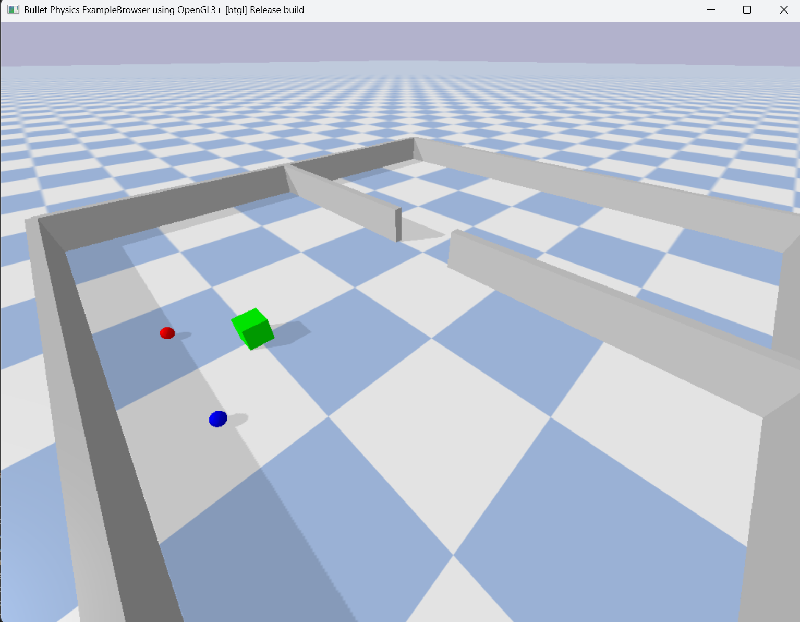

# Multi-Agent Reinforcement Learning for Cooperation Without Communication in Object Maneuvering

The project aims to develop a Multi-Agent Reinforcement Learning (MARL) framework where a team of robots cooperates to maneuver a large, oddly shaped object through a confined space without explicit communication.
 - Inspired by the [Ant vs. Human Cooperation Study](https://www.pnas.org/doi/10.1073/pnas.2414274121), this project explores how robots can self-organize, adapt, and optimize strategies for collective decision-making.
 -  The main research question: "Can reinforcement learning enable a group of robots to outperform individual decision-making in a constrained environment?"

 ## Problem Description
 The Piano Movers' Problem involves maneuvering a large, oddly shaped object through a tight, constrained space using multiple agents.
 - Agents (robots) must cooperate without communication to find an optimal path.
 - Similar to how ants outperform humans under communication constraints, we aim to see if MARL-trained robots can learn optimal cooperative strategies.

 ### Tools Selection [(Selection Criterion)](Tools_select.md)
- Pybullet for physics based env
- Pytorch for MARL implementation
- Below shown is the Environment of my Simulation
    

## Implementation on Single Agent
1. Agent towards the cube

    

2. Agents towards cube and attached itself
    
    

3. Agents towards cube and attached itself and moves towards goal
    
    

### Docker Implementation

Follow the steps  👉 [Docker walkthrough](ubuntu/README.md)

### Windows Implementation

Follow the step 👉 [Windows implementation](win/README.md)

 ## My Approach

 MARL Implementation & Training Process(These are my initial thoughts on how I will be proceeding and might change based on results I observe)

 I will be utilising the concept of the Reward Shaping, Instead of a single reward function for the final goal, I will design smaller, step-based rewards that guide the agent toward the overall objective. This incremental approach—often called curriculum learning—helps the agent learn simpler subgoals before tackling complex tasks.
 For instance, 
 
1. Initial Single-Agent Training 
    -  Subgoal A: Train a policy so that a single agent moves toward the object and “attaches” to it (i.e., aligns or latches on).
     - Subgoal B: Extend the policy so the agent maneuvers the object to a specific target location.
 2. Obstacle Avoidance 
    -  Modify the reward function to encourage avoiding walls or other obstacles while maneuvering the object.
 3. Introduce a Second Agent
     -  Use the same previously trained policies for both agents.
     - Encourage cooperative behavior—both agents must coordinate object manipulation.

 4. Increase Complexity
     - Once the agents have demonstrated basic cooperation, increase the object’s complexity or narrow the available space. This tests the robustness of the learned policies.
  
 5. Single Policy for Multiple Agents
    - Eventually, I will train a single policy controlling two (or more) agents simultaneously. This step aims to see if a shared policy can generalize better than separate agent-specific policies.
 6. Final Deployment 
    - Use the trained policy on each agent to achieve the final objective (maneuvering the object through tight spaces without explicit communication).

My Variables
1. State Representation:
    - Each agent observes its position, neighboring agents, object position, and Goal position.
2. Action Space:
    - 8 actions : (attached , detached to an obeject) X (Move forward, backward, left, right)
3. Reward Function:
    -  Here + rewards for movement in the direction of the objective
    - Neg rewards if it moves away from it
    - Exponential reward gain as the distance decreases
    - A reward boost when attached and this rewards decays over time
4. Comparison With Other RL Methods
    - MADDPG vs. QMIX vs. PPO: Compare different MARL approaches.
    - With Communication vs. Without Communication: Evaluate the impact of information exchange.

