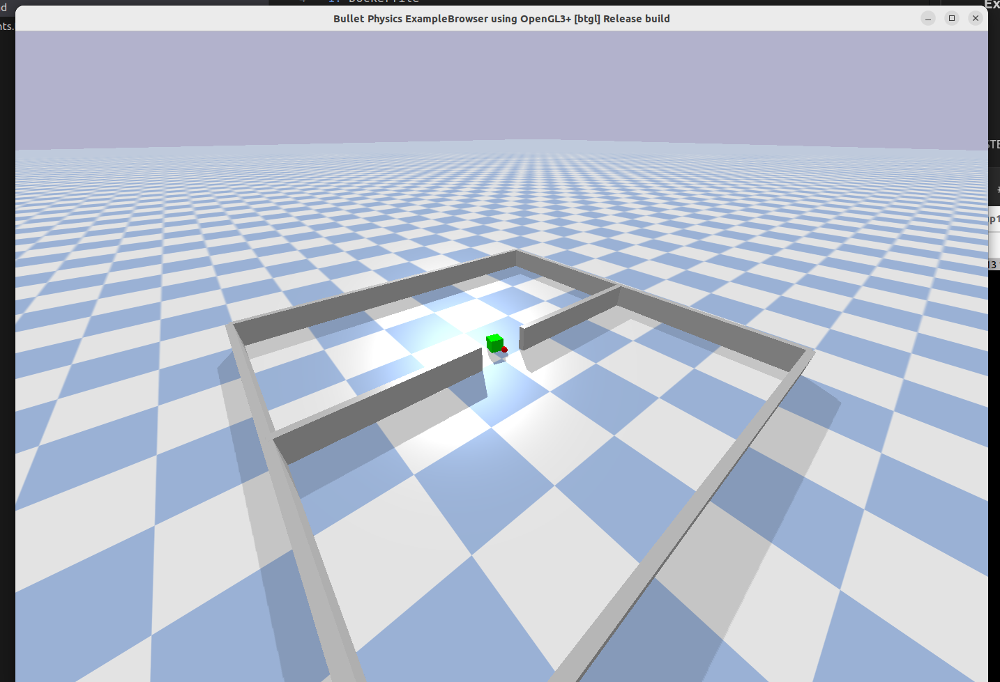

# Docker implemntation for Ubuntu
### Execution of files
CONTAINTS OF THE FOLDER "ubuntu" 
1. Dockerfile
2. requirements.txt
3. group13.zip
4. README.md 
5. env.png

STEP 1: # Clone the Repository
```
git clone https://github.com/keyurborad5/Multi_Agent_Reinforcement_Learning.git
# navigate inside the folder
cd Multi_agent_Reinforcement_Learning/ubuntu
```

STEP 2: # Build the docker IMAGE from Docker file
```
# Navigate your terminal to this folder containing my Dockerfile

docker build --network=host -t marl_image .
# This will create a docker image and you can validate using
docker images
```
STEP 3: Make a docker Container using this docker Image
```
# give permissiop for GUI
xhost +local:docker
# Docker container
docker run -it --rm -e DISPLAY=$DISPLAY -v /tmp/.X11-unix:/tmp/.X11-unix --name marl_container marl_image
```

Now you should me inside the docker.

STEP4: Execute my program
```
cd group13
python group13_enpm690.py 

```
Once the program starts you should see the simulation begins and there will be 5 episodes.

Terminal will print the rewards after each episodes

Expected Output is you should be able to see
- Agents spawning at different location
- Agent moves towards the cube
- Agents attached to the cube
- Agent drags the cube to the other side of the space thorugb narrow wall
- Hence episode ends

Simulation image

